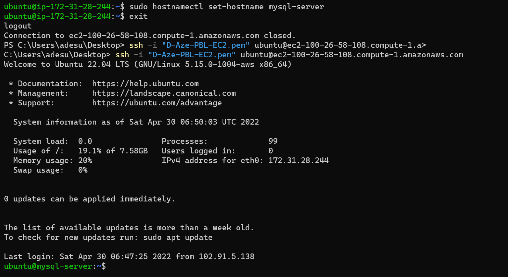
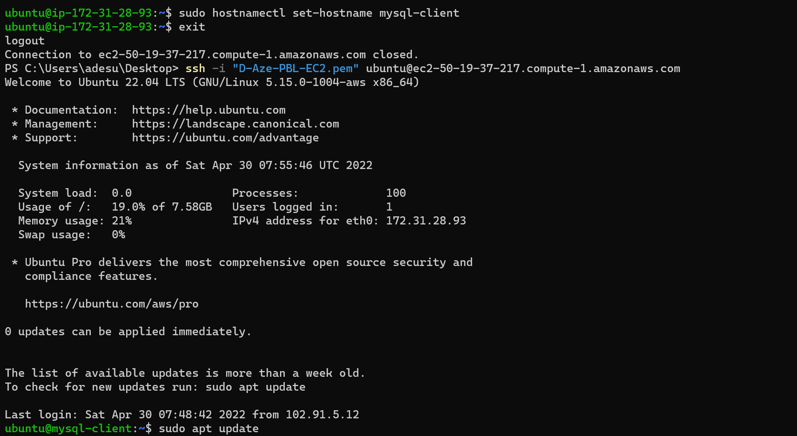
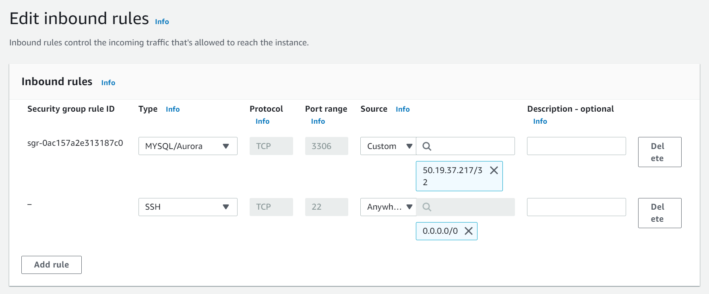
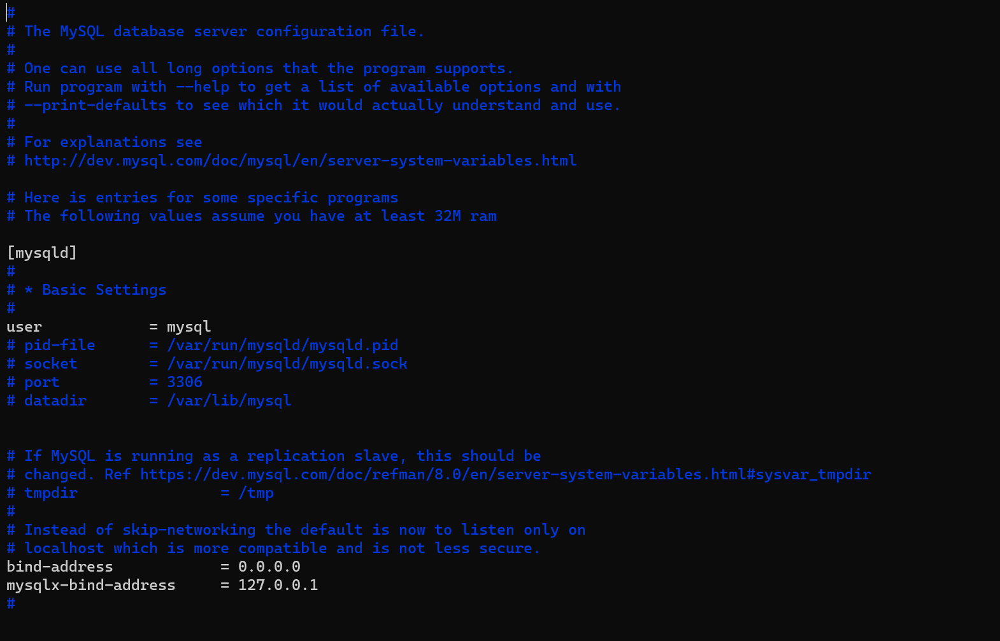
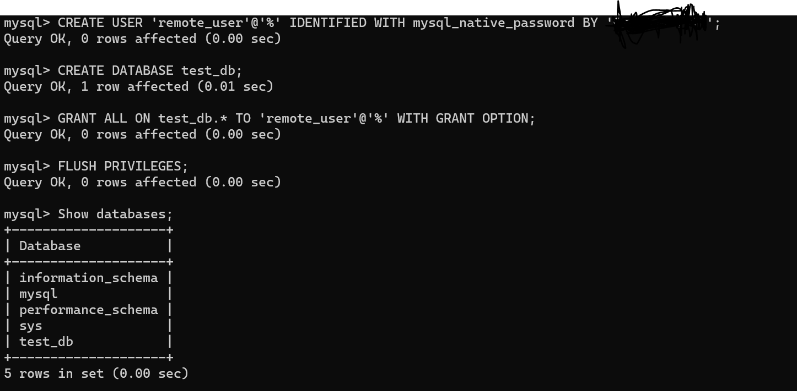
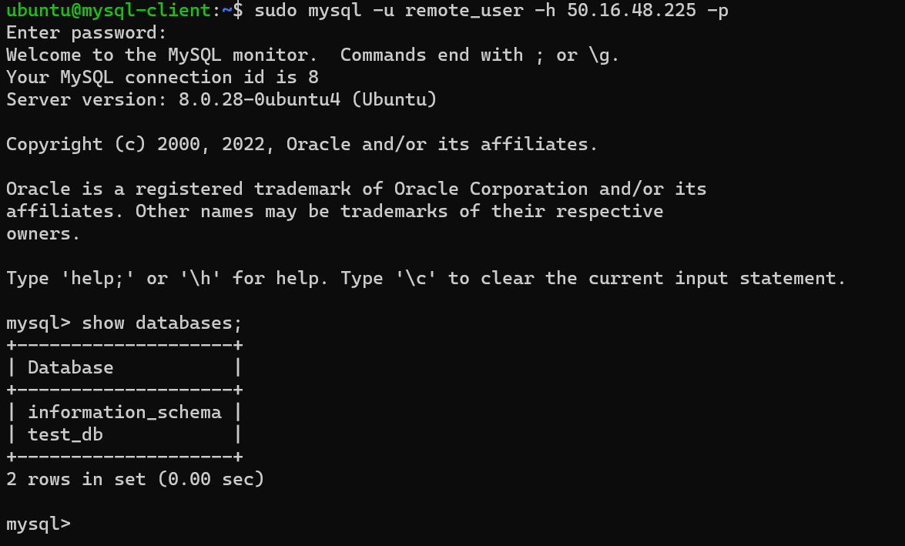

# Documentation of Project 5

## 1. Create and configure two Linux-based virtual servers (EC2 instances in AWS)

Rename instances via: `sudo hostnamectl set-hostname mysql-server` and `sudo hostnamectl set-hostname mysql-client` respectively

Server A name - `mysql-server`

Server B name - `mysql-client`

## 2. Update and upgrade Ubuntu on both servers

`sudo apt update`

`sudo apt upgrade`

## 3. On the mysql-server Linux eerver, install MySQL Server software

`sudo apt intstall mysql-server`

## 4. On mysql-client Linux server, install MySQL Client software

`sudo apt intstall mysql-server`

## 5. Use mysql-server's local IP address to connect from mysql-client

By default, both EC2 virtual servers are located in the same local virtual network, so they can communicate to each other using local IP addresses. MySQL server uses TCP port 3306 by default, so open it by creating a new entry in ‘Inbound rules’ in ‘mysql server’ Security Groups. For extra security, do not allow all IP addresses to reach the ‘mysql server’ – allow access only to the specific local IP address of the ‘mysql client’.

## 6. Secure the server with a password

`sudo mysql_secure_installation`

Set password accordingly.

## 7. Configure MySQL server to allow connections from remote hosts

`sudo vi /etc/mysql/mysql.conf.d/mysqld.cnf`

Replace ‘127.0.0.1’ to ‘0.0.0.0’ in the bind-address

## 8. From mysql-client Linux server, connect remotely to mysql-server Database Engine without using SSH

Use the mysql utility to perform this action thus:

- Run `sudo mysql` and then run sql commands:

`CREATE USER 'remote_user'@'%' IDENTIFIED WITH mysql_native_password BY 'password';`

`CREATE DATABASE test_db;`

`GRANT ALL ON test_db.* TO 'remote_user'@'%' WITH GRANT OPTION;`

`FLUSH PRIVILEGES;`

- Check that you have successfully connected to a remote MySQL server and can perform SQL queries by running `show databases;`

- Exit mysql via `exit` and restart it via `sudo systemctl restart mysql`

- Run `sudo mysql -u remote_user -h < IP address of database server > -p` on the mysql-client, and then `show databases;`

## 9. Check that you have successfully connected to a remote MySQL server and can perform SQL queries

`show databases;`

## Fin!